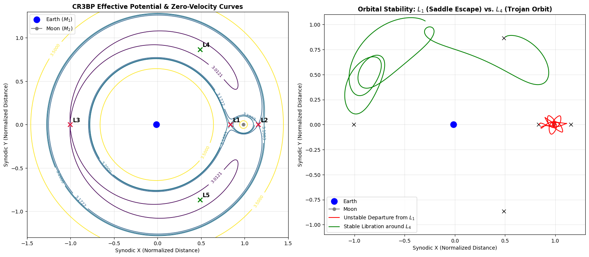

# The-Circular-Restricted-3-Body-Problem-Lagrange-Point-Dynamics
Circular Restricted 3-Body Problem (CR3BP) simulator modeling zero-velocity curves, Jacobi constant conservation, and Lagrange point stability in Python.
# Circular Restricted 3-Body Problem (CR3BP) & Lagrange Point Dynamics

A computational astrophysics simulation modeling the Earth–Moon Circular Restricted 3-Body Problem (CR3BP) in a non-inertial rotating synodic frame using 4th-order Runge-Kutta integration in Python.

## Overview
- **Astrodynamics Framework:** Formulates equations of motion within a rotating coordinate frame with normalized mass parameter $\mu = \frac{M_2}{M_1 + M_2} \approx 0.01215$, incorporating both centrifugal gradient forces and velocity-dependent Coriolis accelerations.
- **Lagrange Equilibrium Solutions:** Uses Brent's root-finding algorithm ($\nabla \Omega = 0$) to analytically locate all 5 Lagrange points ($L_1$ to $L_5$) and evaluate their respective Jacobi constants ($C$).
- **Orbital Stability Analysis:**
  - **Collinear Points ($L_1, L_2, L_3$):** Demonstrates saddle-point instability where small perturbations cause exponential divergence (JWST/SOHO station-keeping analog).
  - **Triangular Points ($L_4, L_5$):** Demonstrates passive Coriolis stabilization resulting in bounded tadpole libration orbits (Trojan asteroid dynamic).

## Governing Equations
- **Effective Potential:**
  $$\Omega(x, y) = \frac{1}{2}(x^2 + y^2) + \frac{1 - \mu}{r_1} + \frac{\mu}{r_2}$$

- **Non-Inertial Equations of Motion (Rotating Frame):**
  $$\ddot{x} - 2\dot{y} = \frac{\partial \Omega}{\partial x}$$
  $$\ddot{y} + 2\dot{x} = \frac{\partial \Omega}{\partial y}$$

- **Conserved Jacobi Integral:**
  $$C = 2\Omega(x, y) - (\dot{x}^2 + \dot{y}^2)$$

## Repository Structure
- `lagrange_cr3bp_simulation.ipynb`: Complete numerical simulation, root-finding solver, and visualization routines.
- `cr3bp_lagrange_stability.png`: Zero-velocity contour maps and trajectory stability phase portraits.
